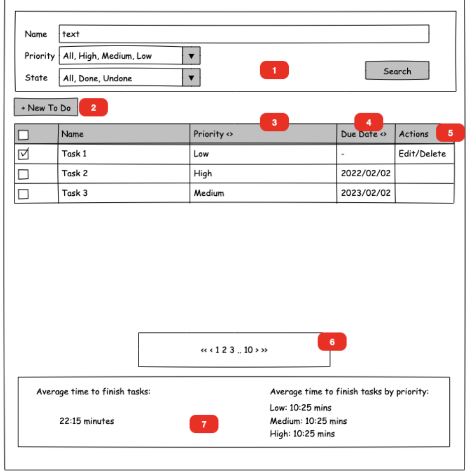
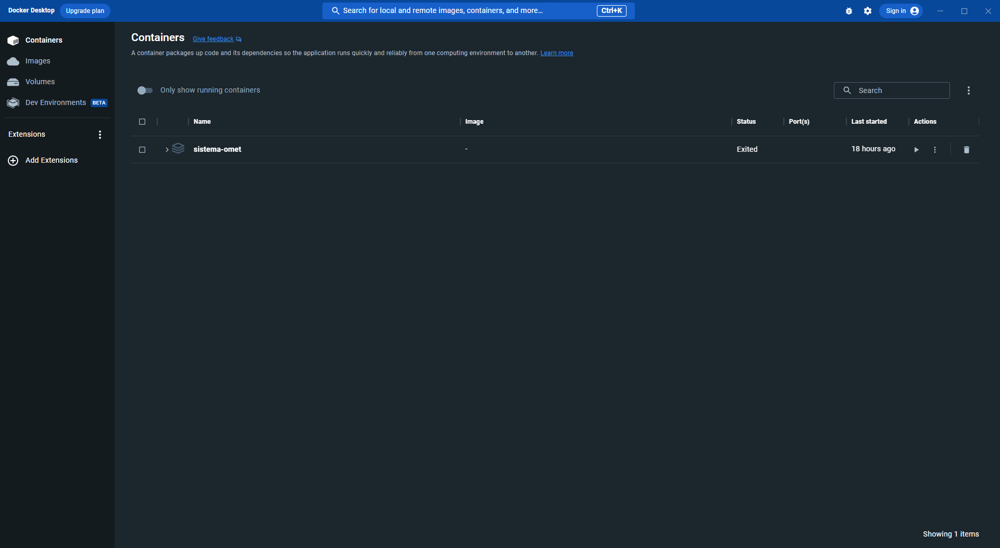
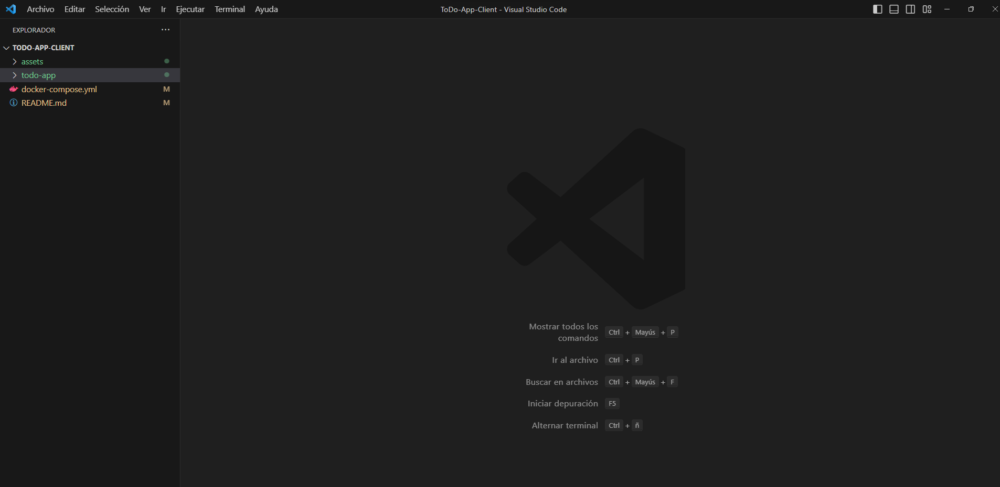
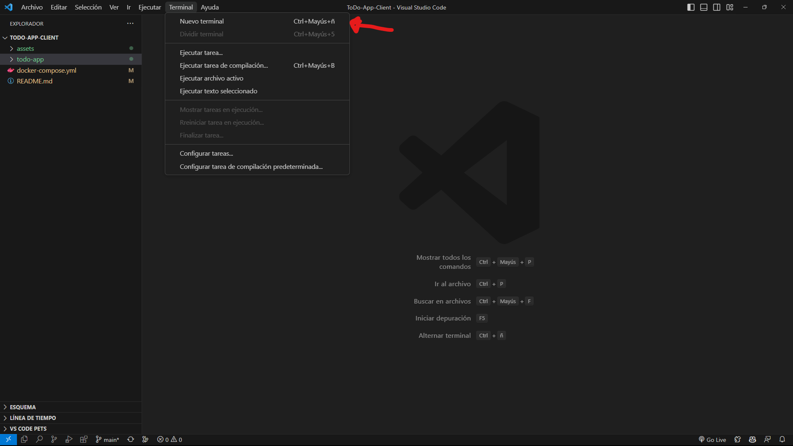
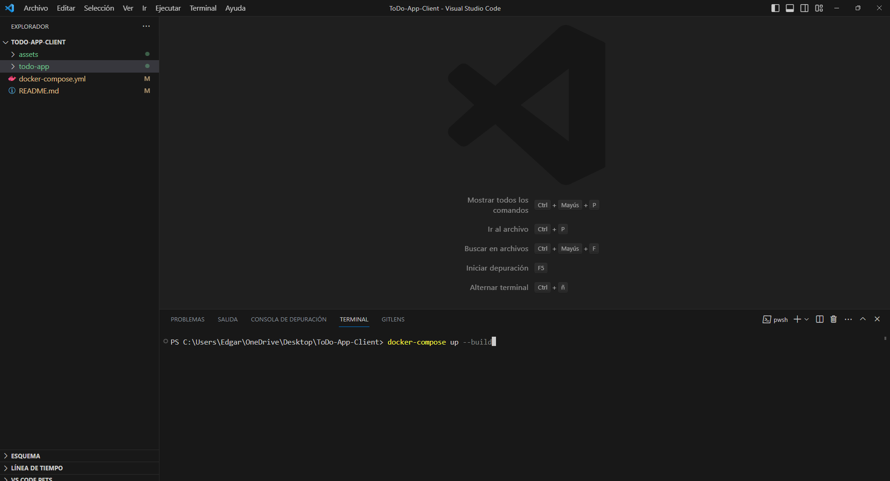
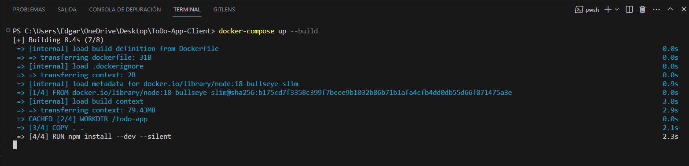
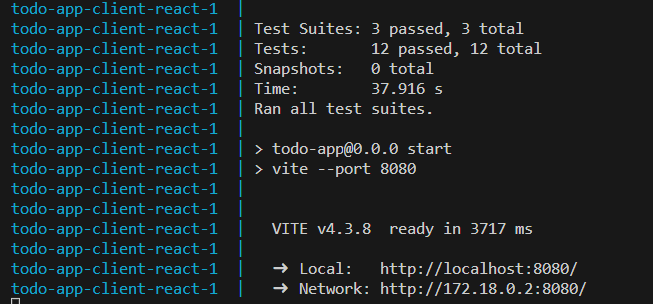
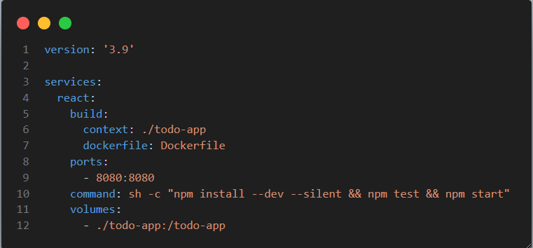
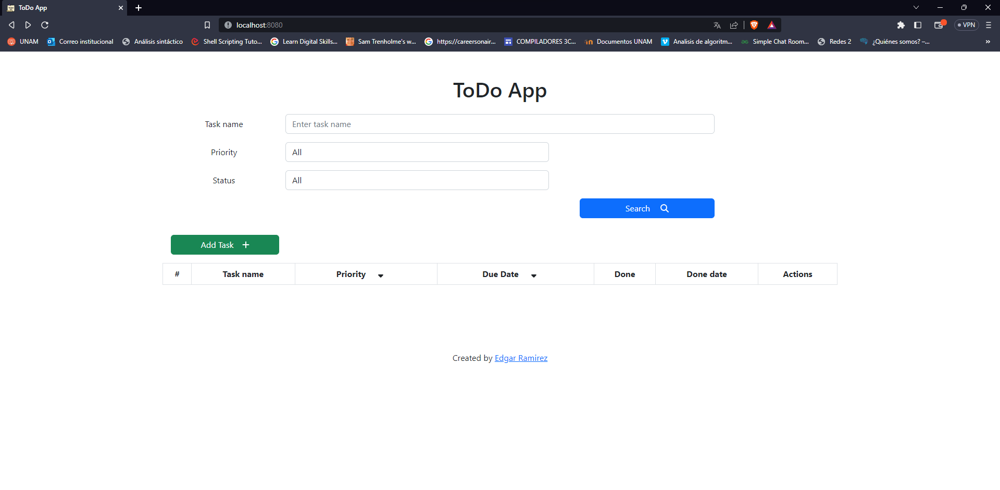

# To Do App

## Table of Contents

- [About](#about)
- [UI requirements](#requirements)
- [Front-end Technology](#technology)


## About <a name="about"></a>

You are working with a client that needs to implement a to do list to help manage their tasks in their daily job. The client asked you to implement the following functionality: 

- Create a “to do” specifying the name, a priority, and possibly a due date 
- Ability to edit name, priority and due date for existing “to do” tasks 
- They want to be able to specify a due date or clear the due date (because they are not interested in when to finish that “to do”) 
- Be able to filter “to do’s” specifying the name (or part of the name), and the priority, and if they are done/undone. 
- Be able to sort the “to do’s” by priority and/or due date.   
    - For example, be able to sort items where their due date is soon and sort them also by priority to see what tasks are more urgent or less urgent 
- Mark “to do’s” as done (clicking in a checkbox) or to undone a “to do” 
    - The undone functionality is just there if there is a mistake :D 
- Since it is possible that the client will have a lot of “to do’s” they need to paginate the list of “to do’s” 
- Ability to know, in average, the time between creation and done for all “to do’s”. This should be shown in general for all done “to do’s” and also grouped by priority. 
    - This is important for the client since this is a metric they follow to measure performance. 

## UI Requirements <a name="requirements"></a>

The UX/UI Team of the client is asking you to conform with the following markup to design the app. 



1. Search/Filtering Controls 
2. New To Do Button. This should open a modal to type the “to do” data. 
3. Priority column should show in the header the classic up and down arrows to allow the user to sort 
4. Due date column should show in the header the classic up and own arrows to allow the user to sort 
5. Action column to show actions (links/buttons) to allow the user to delete or edit a “to do” 
    - To Edit is ok to show a modal similar to the one to create a “to do” 
6. Pagination control. Showing the pages, its number and the next and previous page is enough. 
7. Area to show the metrics 


### Nice to have for the UI 

- Show the row with background colors depending on the due date: 
    - No due date – No background color 
    - One week between due date and today – Red background color 
    - 2 weeks between due date and today – Yellow background color 
    - More that 2 weeks between due date and today – Green background color 

- Strikethrough fonts for those tasks marked as done 

# Front-end Technology 

For the front-end project, you have to use: 
- JavaScript 
- ReactJS 
- Up to you to use Redux or React Context 

They need at least the following commands to run the project: 
- npm run start – To run the front-end application 
- npm run tests – To run all tests in the front-end application 

Front end project must run in port 8080. 

# Usage

This project was developed using Docker containers to make installation and usage easier, but if you don't want to use Docker you can run the project and tests using the **npm commands** inside the todo-app directory, which contains the React App.

## Requirements
- [Docker](https://www.docker.com/) (Only if you will use Docker to run the project)
- [Node/npm](https://docs.npmjs.com/downloading-and-installing-node-js-and-npm) (Only if you will not use Docker to run the project)
- Code Editor or IDE (For this example we will use [Visual Studio Code](https://code.visualstudio.com/))
- Install and Run the [ToDo App  API](https://github.com/EdgarRamirezFuentes/ToDo-App-API).


## Installation

### Using Docker

The best thing about using the project with docker is that you can install all the dependencies, test the project, and run the app using just one command, which is:
```bash
Windows/MacOs
docker-compose up --build

Linux
sudo docker-compose up --build
```

Docker helped us to automate the node/npm installation, dependencies installation, running test, and running the app.

Another advantage of using Docker is that you don't need to care about configuring the development environment in other computers, because Docker uses containers where the app runs, and it works in any computer you use because the Dockerfile contains the container configuration to make the app run in a correct development environment.

### Steps

- Install Docker Desktop 
- Open Docker Desktop. As you can see, at this moment there is no container for our ToDo App Client (React App)

- Open this project in Visual Studio Code.

- Open a terminal in Visual Studio Code

- Run the following command in the terminal: ```docker compose up --build```


As you can see, after running the command, Docker will configure the container to run the app by installing node and the project dependencies.


After the container was configured correctly, Docker will run the test using the command ```npm test```. If every test passed, Docker will run the app using the command ```npm run```




- As you can see, Docker shows that the app is running in ```http://localhost:8080/```.
- Open your Web Browser and go to ```http://localhost:8080/```.



Click [here](https://youtu.be/Wu-HqB15H1o) to see the app working.